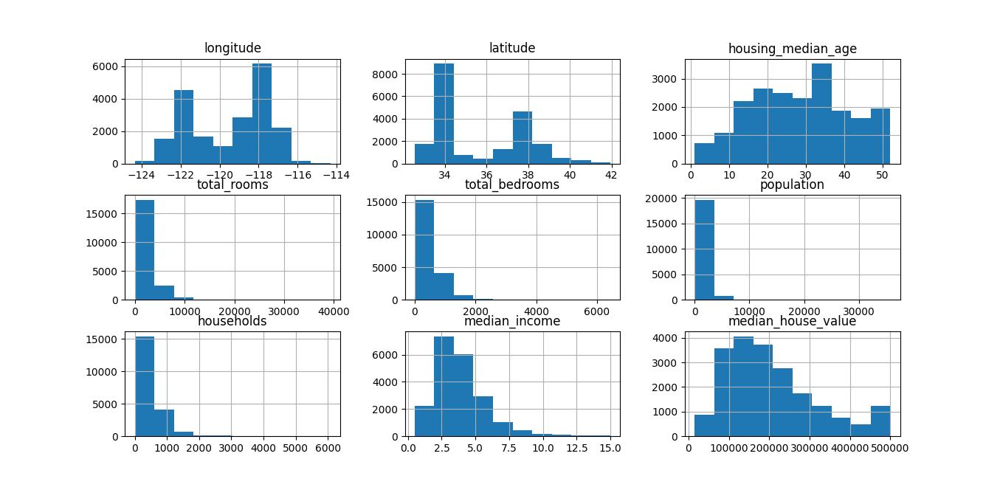
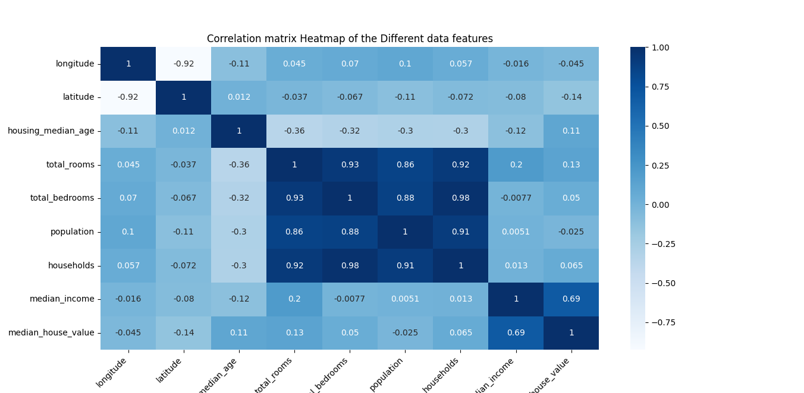
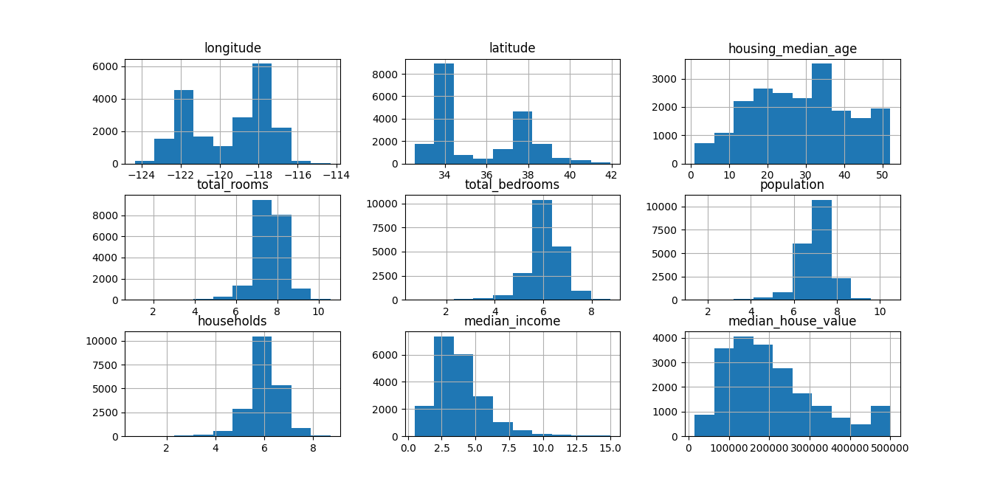
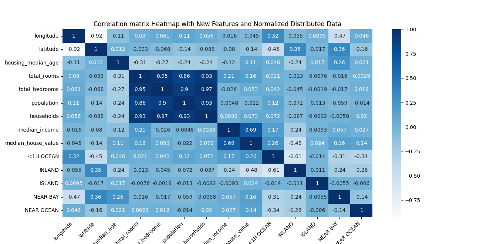

### distibition of the data using hist()
the chart below shows the distribution of the data using the ``hist()`` function

```
data_df.hist()
```



### Correlation matrix heatmap chart
the correlation matrix shows the correlation or the relationship between the different features

| values | definition |
| --- | --- |
| -1 | negative correlation (as one values increases the other decreases) |
| 0 | no correlation |
| 1 | positive correlation (as one values increases the other value increases) |





### Histogram chart after normalizing the house dataset features
**Features that have been normalized:**
- households
- population
- total_rooms
- total_bedrooms



### Correlation heatmap after data normalization and additional new features




Analysis for the correlation of the target variable:
correlation values which have:

| values | definition |
| --- | --- |
| -1 | negative correlation (as one values increases the other decreases) |
| 0 | no correlation |
| 1 | positive correlation (as one values increases the other value increases) |


| target_feature | dataset_feature | correlation_value | category |
| --- | --- | --- | --- |
| median_house_value | longitude | -0.045 | negative correlation |
| median_house_value | latitude  | -0.14 | negative correlatoin |
| median_house_value | house_median_age| 0.11 | no correlaton |
| median_house_value | total_rooms | 0.16 | slightly better correlaton |
| median_house_value | total_bedrooms| 0.053 | no correlation |
| median_house_value | population | -0.022 | negative correlation |
| median_house_value | households | 0.073 | no correlation | 
| median_house_value | median_income| 0.69 | slightly better correlaton |
| median_house_value | <1HOCEAN| 0.26 | slightly better correlation |
| median_house_value | inland | -0.48 | Negative correlation |
| median_house_value | island | 0.024 | No correlatoin |
| median_house_value | near bay | 0.16 | slightly better |
| median_house_value | near ocean| 0.14  | slightly better |
